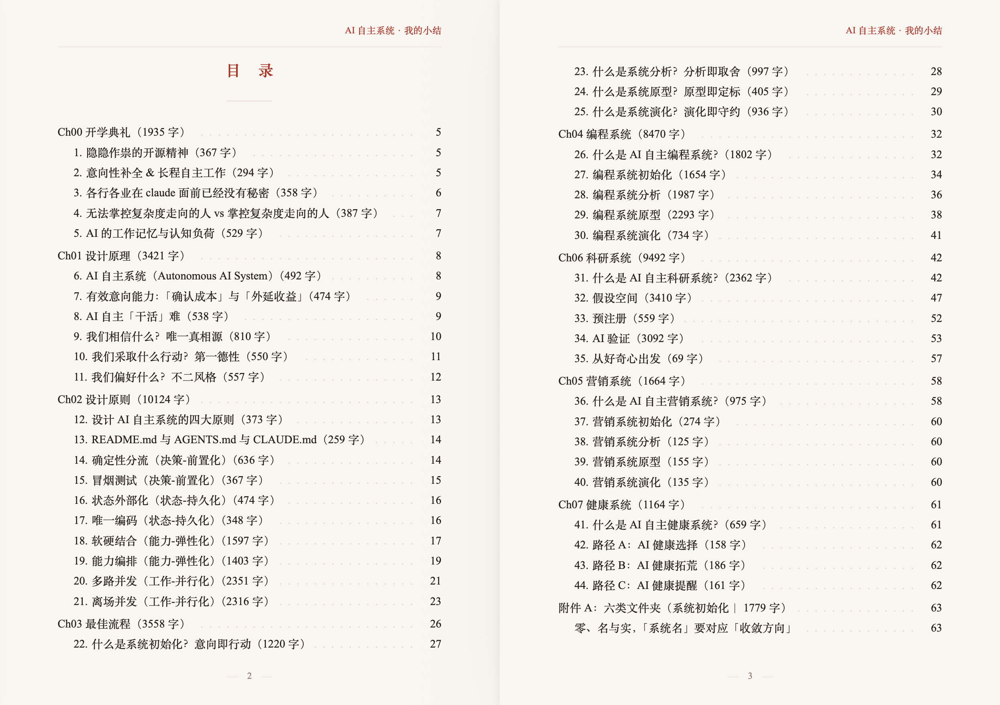
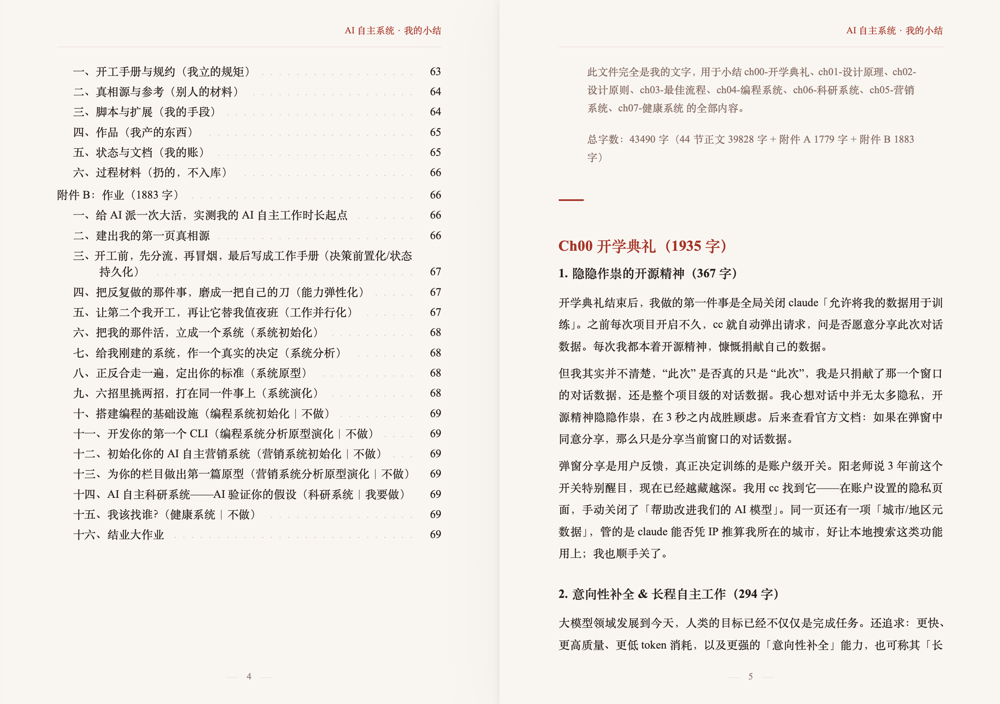

红蕖落尽，荷钱犹小，九月已近尾声。学完「AI 自主系统」，我收获了什么？

秋凉晚步，杨万里行至池畔。满池红荷落尽，诗人不觉悲凉，只感到一点轻寒恰好宜人。低头细看，残叶之间竟又冒出几片新荷，小如铜钱。小小荷钱，从夏日清晨到秋日傍晚，依旧暗自蓄力。

## 1. 什么是 AI 自主系统

2025 年 11 月，在「零基础 AI 产品研发训练营」，我第一次在 CLI 命令行界面中使用 Claude Code。在那之前，我一直在 Chat 界面使用 ChatGPT 等其他大模型。当时，临近硕士第一学期的期末，我在日记中写下：站在阳老师的肩膀上，得以将平时对大模型那种朦胧的感知，一遍又一遍地临摹得更加清晰。

2026 年 03 月，在「Claude Code 101」，我第一次系统学习 CC 的工作原理和四个扩展机制 Skill、Command、Hook、Agent。在那之前，我正在一个深度学习项目中，尝试摸索如何用 AI 辅助科研。当时，正值硕士第二学期的期中，我在日记中写下：已有好刀，只待屠龙。我该如何用好这把好刀？

2026 年 04 月，在「零基础 AI 大模型训练营」，我第一次系统学习大模型训练全流程。从数据预处理与理解模型架构，到预训练与后训练，再到模型量化、评估、与部署。在那之前，我还没完全消化 CC101。当时，正值硕士第二学期的期末，我在日记中写下：从两个最小开始——最小数学知识、最小计算机知识，完整手搓一个最小大模型。用一个最小但完整的大模型，去撬动所有大模型。

2026 年 07 月，在「AI 自主系统训练营」，我第一次在 CC 中搭建 AI 自主系统。从 AI 自主系统的设计原理与设计原则，到系统初始化/系统分析/系统原型/系统演化，再到编程、科研、营销、健康四个系统应用场景。在那之前，我刚刚发表了自己的第一篇科研论文，并在计算叙事模型国际研讨会上展示。此时此刻，恰逢硕士第三学期开学，硕士论文、申博秋招接踵而至，我在日记中写下：我一定要挤入大模型公司，无论大小、无论地点、无论薪酬。在月球的暗面，吾亦要深度求索。

<strong>什么是 AI 自主系统？</strong>在 8 月份之前，我对自主程度的认知是模糊的；在我做项目时，人与 AI 的边界是模糊的；我甚至还没有要建立一个“系统”的意识。随着课程推进，我用自己的话陆续写了 44 张卡片。卡片拼接成册，共计约 4 万字。目录如下：

AI 自主系统（Autonomous AI System）拆开为 3 个概念：AI、自主、系统。「AI」代表人与 AI 协同工作的混合智能。「自主」表示长程自主工作能力。「系统」是指为了实现某种意图、被设计出来的、一种界面。其中最重要的概念是「自主」。自主与自动最关键的区别是「意向性补全」。

<strong>什么是「意向性补全」？</strong>你早上用 30 分钟时间跟 AI 沟通，AI 自动澄清你的意图，甚至自动补全你一个上午的工作意图。在这个过程中，人类大量不知道如何表达的意图、还没来得及表达的意图，AI 都能很好地补全。在认知写作学中，我们讲「社会意向性」是「一个人理解他人意图的能力」。那么，以此类推「意向性补全」则是「一个大模型补全人类意图的能力」。在这个补齐的过程中，大模型表现出一种类人的智能，我们称之为长程自主工作能力。

<strong>系统有多自主？</strong>自主程度可以参考自动驾驶的分级体系。国际通用标准 SAE J3016 由美国汽车工程师学会于 2014 年首次发布。当前最新 2021 版把自动驾驶分为六级，我们正处在从 L2 到 L3 的过渡阶段：L0 无驾驶自动化、L1 驾驶辅助、L2 部分驾驶自动化、L3 有条件驾驶自动化、L4 高度驾驶自动化、L5 完全驾驶自动化。<strong>AI 自主系统分级？</strong>我们的目标是从 L2 到 L3，从少量人类介入，到模型调用工具能自主完成：

- L0 模型 + harness + 人类（操作：人类）
- L1 模型 + harness + 大量人类工作量，能自主完成（操作：人类为主）
- L2 模型 + harness + 少量人类工作量，能自主完成（操作：系统为主）
- L3 模型 + harness 能自主完成（操作：系统）
- L4 模型自主完成（操作：模型）

## 2. 为什么要搭建 AI 自主系统

### 为了跨窗口延续你的意向

"到 2026 年 08 月，当一个大模型达到某种参数级别、对齐人类集体意向、且这一切发生在一个对话窗口内时，AI 就已经具备了意向性补全能力。" 一开始，我并不理解为什么一定要「发生在一个对话窗口」？在后来的实践中，我确实感到跨窗口很难完整地延续意向。在搭建 AI 自主系统之前，我通常用两种操作来实现跨窗口延续意向：一、在旧窗口写一份派活指令或提示词文件，带到新窗口按路径读取。二、在新窗口中读取 42plugin chat 导出的旧窗口对话。

跨窗口、跨轮次对话时，大模型其实根本不记得另一个窗口、上一轮对话里的任何事。大模型判断对错，只靠既有知识和自我反思。既有知识已在预训练和指令微调阶段固定。自我反思也靠不住：Claude 公司发现，只要人一质疑 CC，它就开始不自信，幻觉上升、性能下降。所以，我们需要一个 CC 外部的、不随对话摇摆的东西，来作准则，来反复对齐。不是对齐一次，而是每个窗口、每轮对话都要对齐一次。在搭建AI 自主系统之后，我逐渐掌握第三种操作来实现跨窗口延续意向：三、建立唯一真相源。

### 为了更好地掌握复杂度的走向

人与 AI 协同工作是一个全新的话题。阳老师甚至认为，诞生了一门全新的学科——「混合认知科学」。认知科学研究人和其他智能体的心智。「混合认知科学」研究混合智能——人与 AI 如何协同才能让双方都最舒服。除此以外，阳老师认为甚至还诞生了另一门新学科——「混合系统科学」。系统科学研究以生物、自然为主的复杂系统。「混合系统科学」研究混合智能——人工智能、类人智能、真正人类构成的复杂系统。

在这个复杂系统中，会出现什么样的必然现象？答案是「复杂度失控」。无法掌控复杂度走向的人，会发现做项目越来越消耗时间、消耗 token，输出越来越乱、质量越来越差。AI 越来越难以补全你的真实意图；感觉 hold 不住了，不是我想要的那种感觉了！相反，一个明白如何掌控复杂度走向的人，做项目越来越快，做的东西越来越难，感觉越来越轻松，越来越有点感觉！这种感觉，随着一个又一个小作品的诞生越来越明显。

### 为了做出超乎自己想象的作品

AI 诞生之后，世界从可穷举偏向不可穷举，问题空间从 N 维趋向 ∞ 维。 AI 的出现，让系统中的可能产物远大于个人想象。以科研为例，传统的科研路径是从学科出发，但 AI 已经融会贯通打破领域边界。所以正确的科研路径是从问题出发，提出问题、解决问题。如何提出问题？重点是如何提出更多假设供验证。如何解决问题？重点是如何降低验证假设的成本。传统的提出假设路径是自己读文献，自己提出假设，数量是个位数、十位数，但 AI 读文献远快于人。所以正确的提出假设路径是，让 AI 批量提出问题、形成一个问题空间；问题空间中，包含大量超乎个人想象的假设。

挑选假设依然可以人与 AI 协作，分维、排序、对抗性评审。验证假设也是如此，从有界小实验快速 AI 验证，到一步一脚印缩小 AI 验证与领域金标准之间的差距。AI 自主科研系统，从一个经典流程起步——提出假设、挑选假设、验证假设，中间不断分岔，最终方向和起点完也许完全不同。但那些分岔出来的更新更大的假设，也许才是值得一直做下去的超乎自己想象、超乎所有人想象的作品。

## 3. 我的 AI 自主科研系统

在写作系统中，人与 AI 最需要解耦。AI 可以辅助我们排版、润色，却无法替代我们快写。因为快写，是一个人表达真情实感的过程。AI 无法代替你，表达你的真实感受。快写「信息型文本」，一定是真实的思考过程。快写「叙事型文本」，一定是真实的情绪感受。有关写作，我搭建了两个系统。一个名为《我的日记系统 jnl》，文本类型不限；此文就是在该系统中，用<a href="https://aiwriter.cn/" target="_blank" rel="noopener noreferrer">写匠</a>快写、用写匠慢改、用写匠校对润色。

另一个名为《我的 AI 自主科研系统 myrs 》，专注写论文，作品区正在打磨的第一个作品是我的硕士论文。AI 自主科研系统与其他系统的区别在于：是否「解决科研实质问题」。不是让 AI 替我证明形式化定理，也不是让 AI 替我把论文写漂亮，而是让 AI 真正辅助我推进一个前人没有找到的假设。过去做项目，总是局限于课程范围以内；现在写论文，真正从问题出发，不受学科限制，从小切口钻大方向。

9 月份某日晚上，我让 AI 给 35 条候选假设逐条打分，再两两对阵排序。凌晨 0 点左右，它跑完来叫我：5个多小时，调用评审模型 3433 次，裁判一致性合格，排序可用。而 8 月初，我 AI 自主工作时长一般在 15-30 分钟左右。现在的学习节奏：离开家前，告诉 CC 我要出门去学校，断网 30 分钟。到学校，CC 继续干活，我可以离场 2 小时去上课，再回来做需要人给的决策。所以越来越重要的是，AI 在干活，人离场后去干什么？比如，此时此刻我窝在图书馆的角落里，写这篇文章。

myrs 现在做的，是我的硕士论文：从「大模型的意向能力」出发，覆盖选题、文献、实验、成稿全程，一直走到明年 4 月份答辩。九月中，开题报告已经提交。与此同时，我在 myrs 旁边另开了一个沙盒，把提出假设、挑选假设、验证假设完整走一遍。那一晚的 35 条假设，就跑在沙盒里。沙盒可以读 myrs，但绝不往里写。沙盒求多，允许分岔；论文求稳，一步一脚印。沙盒里跑通的东西，再挑着回流进论文。

myrs 走完了系统初始化、系统分析，正在打磨系统原型。初始化，是立起六类文件夹和一份意向书，冲突时以意向书为准。分析，是在 5 个候选研究问题里选定一个，依据是我自己的两篇前作，和一个子方向的一系列近作。原型，是先做一次冒烟，确认管线跑得通。演化才刚开头：我试过一次，四天里信息量没涨，复杂度不降反升。沙盒这一轮的收获，哪些该回流进论文、哪些该扔，是我眼下要决定的事。

myrs 能自己做的事越来越多：批量提出假设，再对阵排序；起草预注册，在看数据之前把判据写死，再用合成数据模拟一遍，抓出会把正常结果误判为成功的漏洞；整夜跑实验，自己抽查日志、处理限流；发现冻结后的脚本有 bug，不偷偷改，登记成偏离等我决策。要我盯着的：每一道闸的阈值、要不要缩窄假设、签字冻结、如实申报自己看过多少数据。

阳老师给过一个精妙比喻：好的 AI 自主系统，应当像一本书，信息量很大，复杂度中等。复杂度中等，结构就有冗余可被压缩。我依然在摸索，如何让 myrs 一次干久：多让机器判对错，再让 AI 代判好坏，尽量减少让人与世界判成败。我希望 myrs 一套活久，不仅活在此时此刻，还能随着时间流逝，在历史演化中也活下来，在信息量与复杂度的博弈中诞生伟大的作品。

## 小结

九百年后的一个清晨，我也走到池畔。残荷犹立，荷钱仍浮在水上。俯身细看，小小一枚，已生脉络：叶心一点，叶脉自此散开，一分为二，二分为四，一路铺到叶缘。晨露落下，无论落在哪一处，滚几滚，终归聚回叶心。

我的 AI 自主系统，如同一枚荷钱。叶脉是分岔，一条假设分出十条，一个窗口分出十路，一夜走出许多条意想不到的假设。叶心是收敛，大量的信息、大量的行动、大量的偏好，最后都要收束为一点。那一点，便是作品。

小小荷钱，一叶接一叶，徐徐生长，终有一日，莲叶田田。

---

<aside class="work-note">注：本文在写匠中快写慢改、校对润色。写匠（<a href="https://aiwriter.cn/" target="_blank" rel="noopener noreferrer">aiwriter.cn</a>）由活水 AI 实验室（<a href="https://42ailab.com/" target="_blank" rel="noopener noreferrer">42ailab.com</a>）开发。</aside>
